# Sommaire

<!--START-->
- [Sommaire](#sommaire)
- [Préféctures](#préféctures)
- [Hiroshima (Chügoku region)](#hiroshima-chügoku-region)
  - [Piste cyclable de Shimanami Kaido](#piste-cyclable-de-shimanami-kaido)
    - [Principaux points d'intérêt](#principaux-points-dintérêt)
    - [1.Temple de Kosan-ji](#1temple-de-kosan-ji)
    - [2. Sanctuaire d'Oyamazumi-jinja](#2-sanctuaire-doyamazumi-jinja)
    - [3. Restaurant de la gare maritime de Naoshima](#3-restaurant-de-la-gare-maritime-de-naoshima)
    - [4. Parc Yoshiumi Rose](#4-parc-yoshiumi-rose)
    - [5. Observatoire de Kirosan](#5-observatoire-de-kirosan)
<!--END-->

# Préféctures

| Töhoku region | Kantö region | Chübu region | Kansai region | Chügoku region |
| ------------- | ------------ | ------------ | ------------- | -------------- |
| Akita         | Chiba        | Aichi        | Hyögo         | Hiroshima      |
| Aomori        | Gunma        | Fukui        | Kyoto         | Okayama        |
| Fukushima     | Ibaraki      | Gifu         | Mie           | Shimane        |
| Iwate         | Kanagawa     | Ishikawa     | Nara          | Tottori        |
| Miyagi        | Saitama      | Nagano       | Osaka         | Yamaguchi      |
| Yamagat       | Tochigi      | Niigata      | Shiga         |                |
|               | Tokyo        | Shizuoka     | Wakayama      |                |
|               |              | Toyama       |               |                |
|               |              | Yamanashi    |               |                |

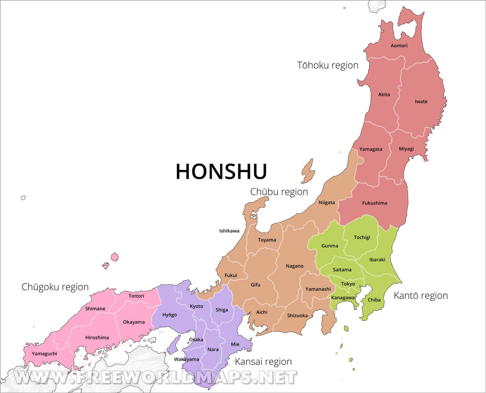

  
# Hiroshima (Chügoku region)

## Piste cyclable de Shimanami Kaido

Piste de 70km reliant plusieurs îles entre Honshu et Shikoku. Un des meilleurs itinéraires à vélo du Japon. Des paysages magnifiques. Des points remarquables tout le long du chemin. Très guidé et notamment adapté aux touristes avec une signalisation en anglais.

> "Possible toute l'année, mais plus grande probabilité de fortes pluies ou de typhons de mi-juin à mi-septembre".

*Attention* : le plan du livre ne passe pas exactement comme le plan du site. Il doit y avoir des variantes.

- [Petit PDF](pdf/shimanami-kaido-petit.pdf)
- [Gros PDF](https://shimanami-cycle.or.jp/en-pamph/)

| Prix 💴                    | Note | Site                                                                                                                                              | Distance de Fukuoka | Durée conseillée | Meilleure période |
| ------------------------- | ---- | ------------------------------------------------------------------------------------------------------------------------------------------------- | ------------------- | ---------------- | ----------------- |
| 2000¥ / j (location vélo) | ⭐⭐⭐  | [Japan travel](https://en.japantravel.com/guide/a-cyclist-s-guide-to-the-shimanami-kaido/68675) ou [Ici](https://shimanami-cycle.or.jp/en-pamph/) | 2h30 🚆  (départ)    | 2 jours          | avant mi-juin     |

| Photo                             | Photo                             | Plan                                   | Plan                                   | Plan                                   |
| --------------------------------- | --------------------------------- | -------------------------------------- | -------------------------------------- | -------------------------------------- |
| 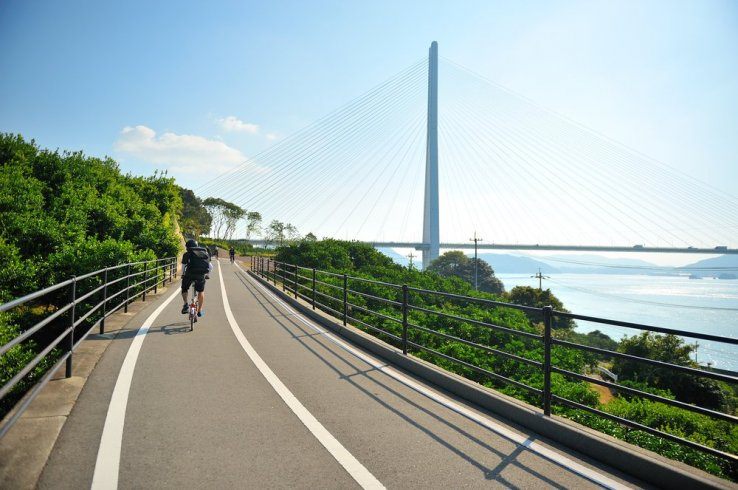 | 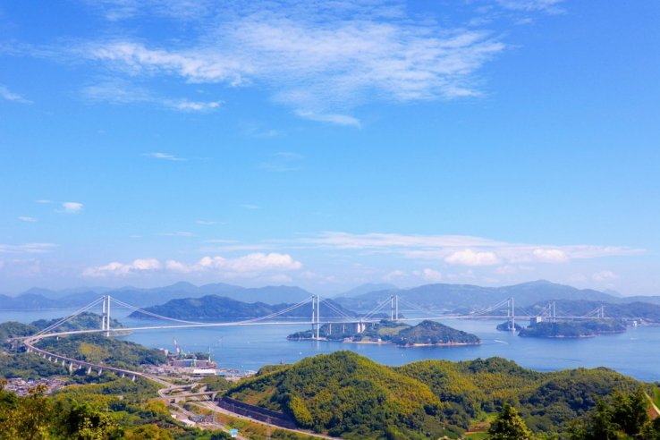 | 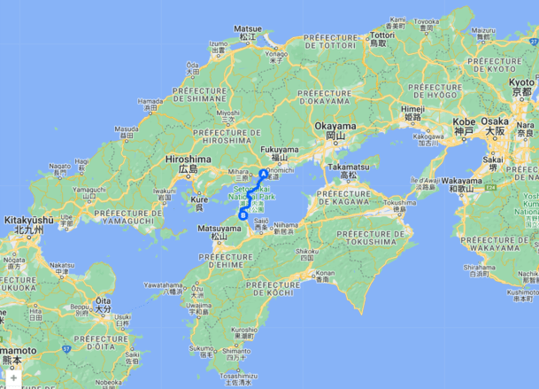 | 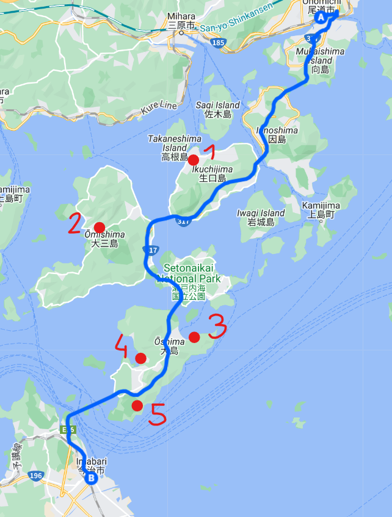 | 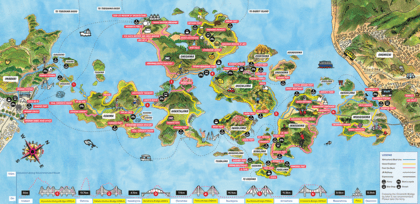 |

### Principaux points d'intérêt

### 1.Temple de Kosan-ji

Temple exposant de nombreuses répliques d'autres temples, c'est l'hommage d'un riche homme d'affaire à sa mère. Construction mettant en oeuvre des technologies de pointe pour l’époque. On y trouve le pavillon (ou la villa) Choseikaku, résidence mi-japonaise mi-occidentale. Beaucoup d'oeuvres à l'intérieur ont été peintes par des artistes parmi les plus célèbres de l’art japonais moderne.  
Se référer au plan du site pour y trouver la liste des éléments à visiter. Notamment la *Colline de l'espoir*, un jardin de marbre de plus de 5,000m² ! Les monuments de marbre semblent en harmonie avec le paysage.

| Prix 💴 | Note | Site                                            | Durée conseillée | Meilleure période |
| ------ | ---- | ----------------------------------------------- | ---------------- | ----------------- |
| 1,400¥ | ⭐⭐⭐  | [Ici en FR](https://www.kousanji.or.jp/french/) | N/A              | N/A               |

| Temple Kosanji                    | Villa Choseikaku                             | Colline de l'espoir                                   |
| --------------------------------- | -------------------------------------------- | ----------------------------------------------------- |
| 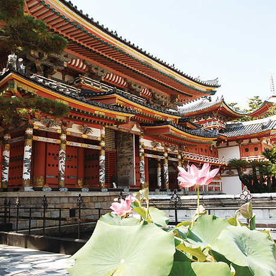 | 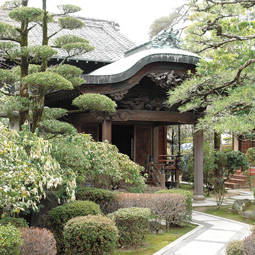 | 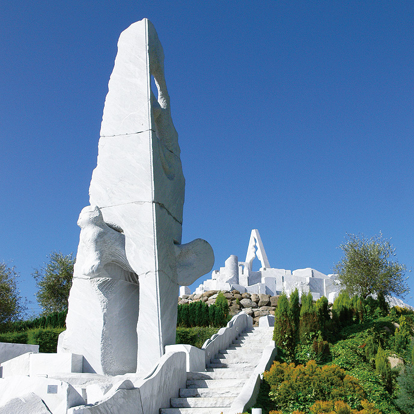 |

### 2. Sanctuaire d'Oyamazumi-jinja

Situé sur l'île d'Omishima, un sanctuaire mythique vieux de 1400 ans. Un bâtiment annexe est la *National Treasure Hall* du sanctuaire, il conserve une des plus grandes collections d'objets de samouraïs du Japon. Les équipements sont des offrandes des samouraïs qui venaient durant plus d'un millénaire prier pour des combats victorieux. La plus vieille arme date d'environ 950.

Festival le 22 avril.

| Prix 💴                                                                     | Note | Site                                                                                                                                                            | Durée conseillée | Meilleure période |
| -------------------------------------------------------------------------- | ---- | --------------------------------------------------------------------------------------------------------------------------------------------------------------- | ---------------- | ----------------- |
| *Gratuit* (sanctuaire) - 1,000¥ (National Treasure Hall + Maritime museum) | ⭐⚫⚫  | Japan travel [Ici](https://en.japantravel.com/ehime/oyamazumi-shrine-treasure-hall/4326) et [Ici](https://en.japantravel.com/places/ehime/oyamazumi-shrine/336) | N/A              | N/A               |

| Photo                            | Photo                                  | Photo                                                    |
| -------------------------------- | -------------------------------------- | -------------------------------------------------------- |
| 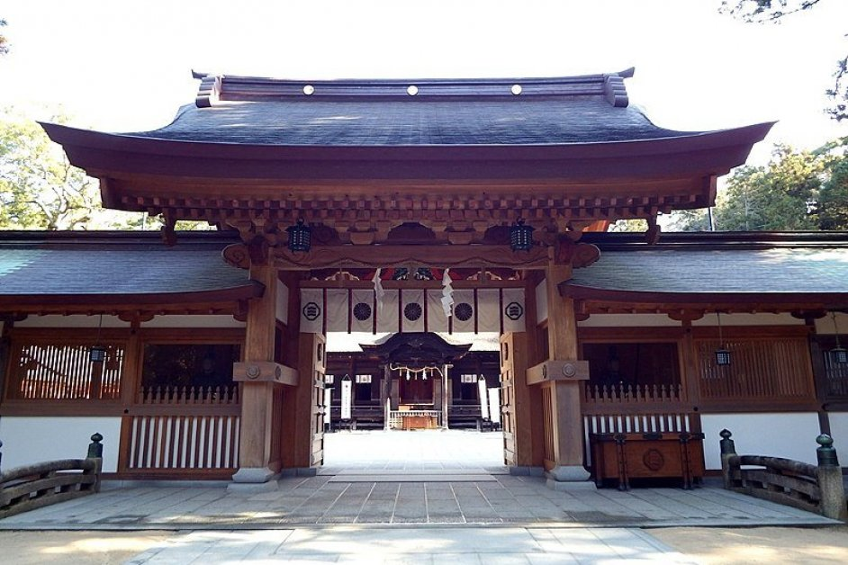 | 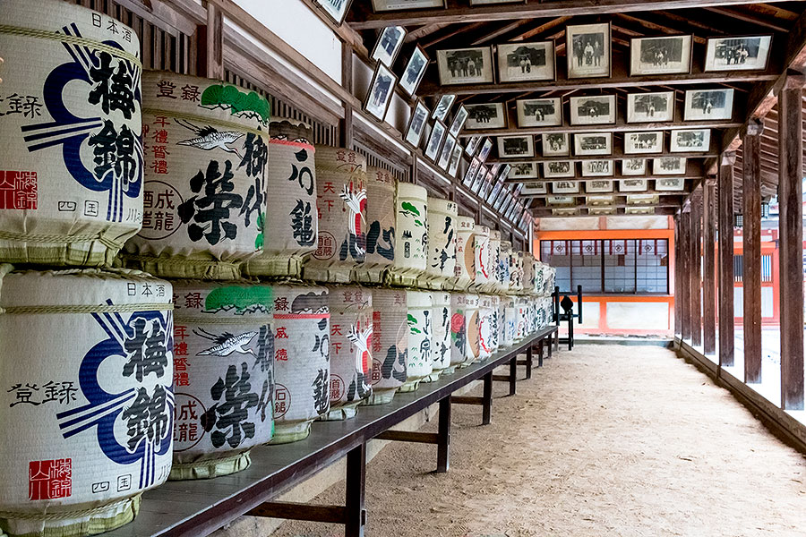 |  |

### 3. Restaurant de la gare maritime de Naoshima

*Attention* : dans le livre ils ont confondu *~~Naoshima~~* avec *Ōshima* (ou Oshima). Il est aussi possible de confondre avec l'île d'~~Izu Oshima~~.  
Référence difficile à trouver mais il paraît que le restaurant propose d'excellents produits de la mer. 

### 4. Parc Yoshiumi Rose

Des *milliers* de rosiers en fleurs de mai à novembre. Vendent des glaces à la rose.  
Près du parc se trouve un centre culturel, comprenant une exposition sur l'évolution des outils d'agriculture, ainsi qu'une collection d'armures et d'armes.

| Prix 💴                                    | Note | Site                                                                                                                                                            | Durée conseillée | Meilleure période |
| ----------------------------------------- | ---- | --------------------------------------------------------------------------------------------------------------------------------------------------------------- | ---------------- | ----------------- |
| *Gratuit* (parc) - 300¥ (centre culturel) | ⭐⚫⚫  | [Site en full-japonais](https://www.city.imabari.ehime.jp/kouen) ou [Article Japan travel](https://en.japantravel.com/ehime/yoshiumi-local-culture-center/1290) | N/A              | À partir de mai   |

| Photo                                | Photo                                |
| ------------------------------------ | ------------------------------------ |
| 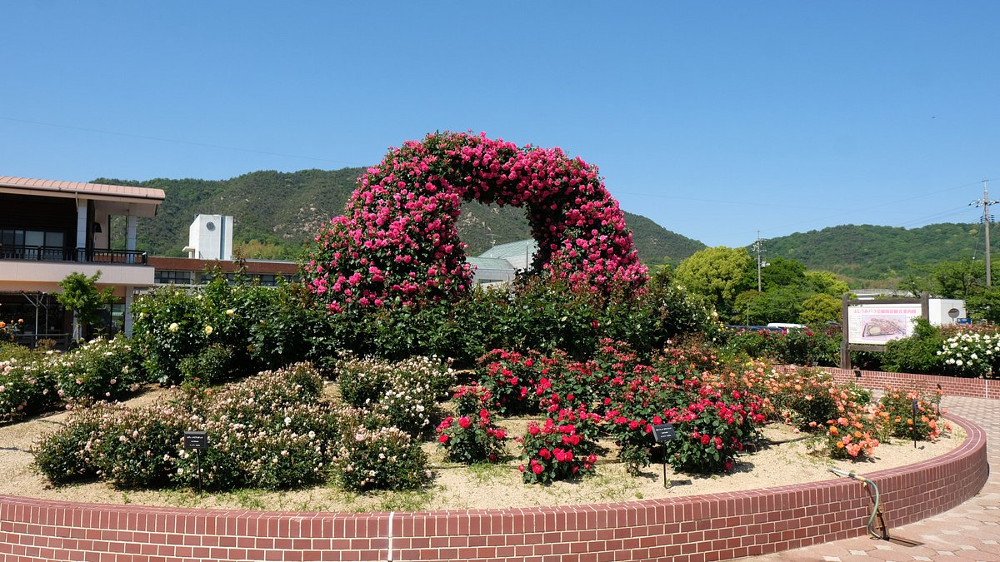 | 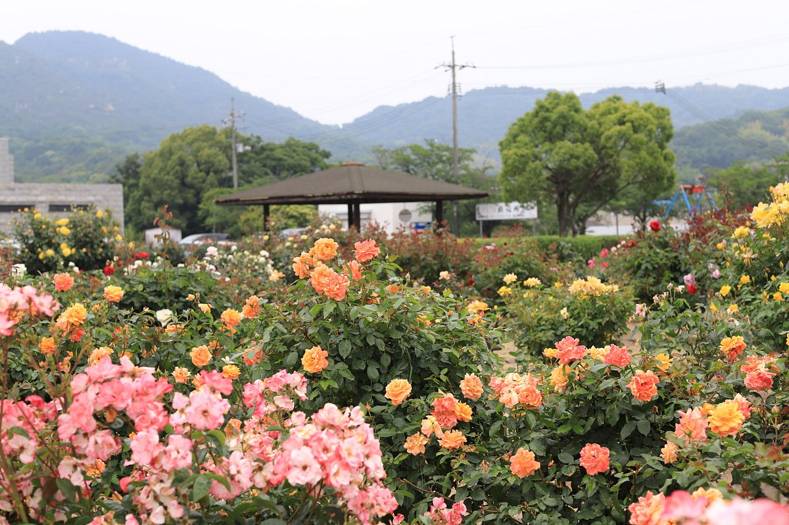 |

### 5. Observatoire de Kirosan

Situé au sommet du mont Kiro au sud de l'île d'Oshima, c'est le meilleur point de vue du Shimanami Kaido. Venir au coucher du soleil pour une vue exceptionnelle sur le pont Kurushima-Kaikyo.

| Prix 💴    | Note | Site                                                               | Durée conseillée | Meilleure période   |
| --------- | ---- | ------------------------------------------------------------------ | ---------------- | ------------------- |
| *Gratuit* | ⭐⭐⚫  | [Shikoku tourism](https://shikoku-tourism.com/en/see-and-do/10002) | N/A              | *Coucher de soleil* |

| Photo                                 | Photo                                 |
| ------------------------------------- | ------------------------------------- |
| 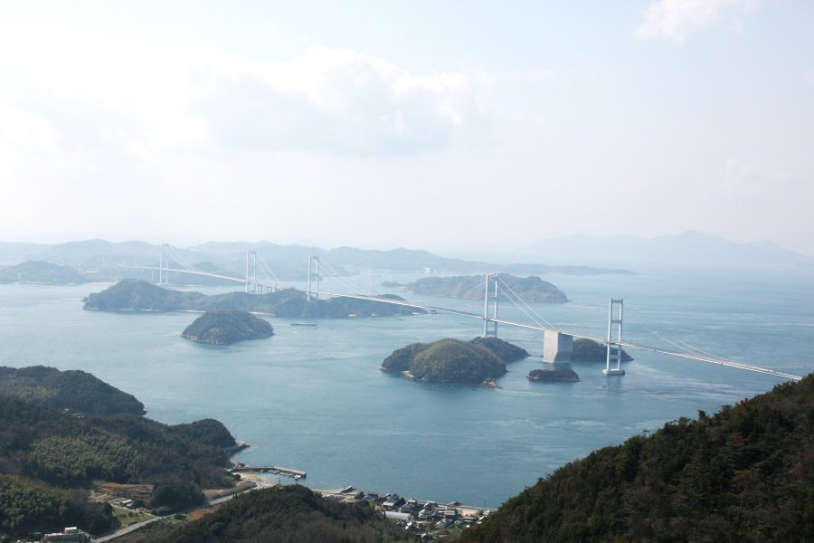 | 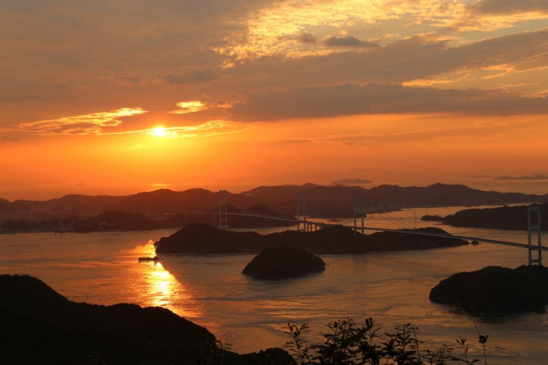 |