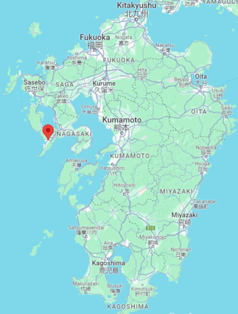
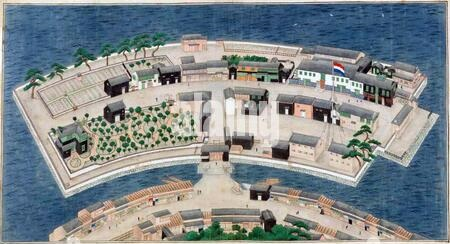
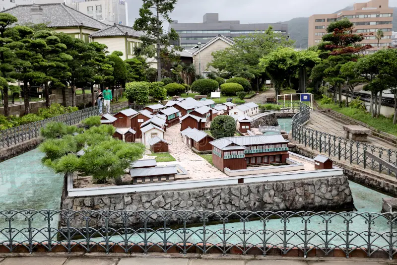
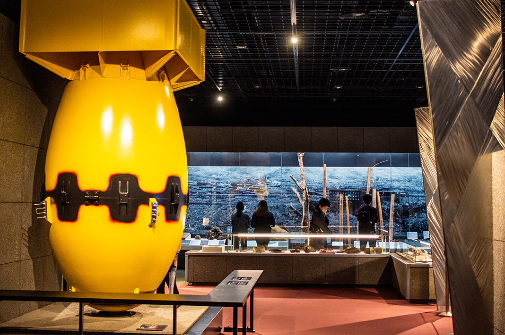
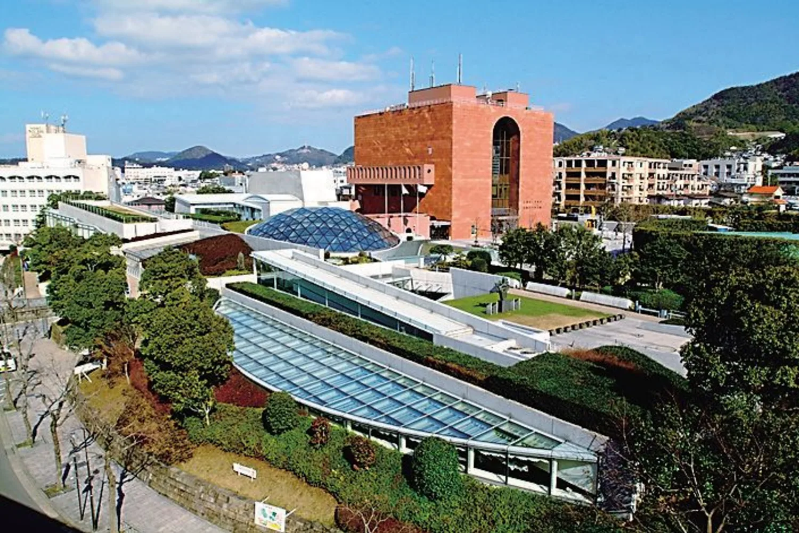
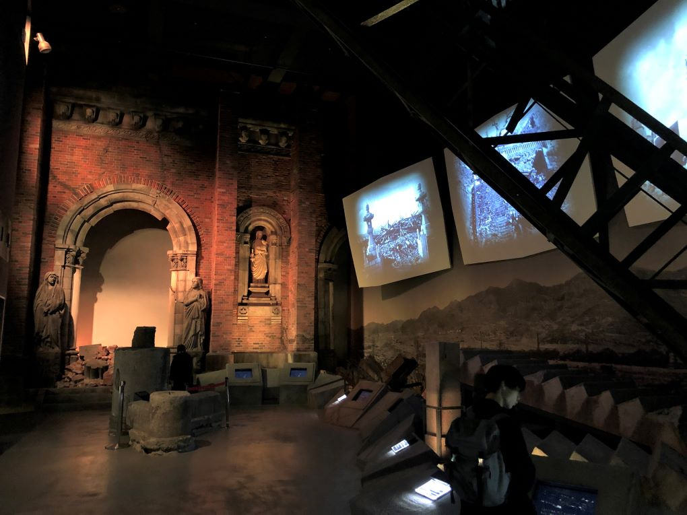
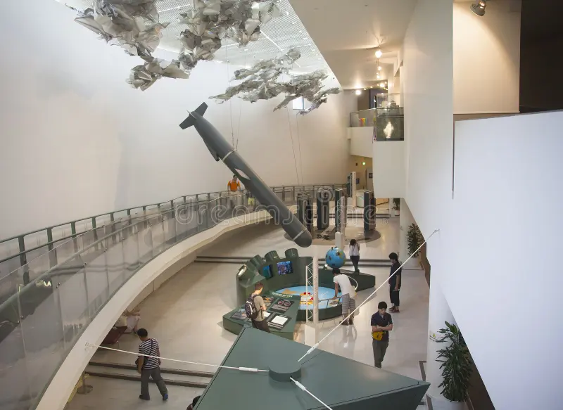

# Points importants

- Les aéroports de Kumamoto, Nagasaki, Kagoshima et Oita sont éloignés des centres, il vaut mieux visiter une voiture pour les visiter.

- Prévoir des espèces : "dans certaines régions rurales, trouver un DAB relève de l'anventure". Retirer dans les DAB des JP Bank ou des les 7-Eleven.

- Service

## Modes de déplacement

| Train                                                                                                                                        | Bus                                                                                                     | voiture                                                                                                     |
| -------------------------------------------------------------------------------------------------------------------------------------------- | ------------------------------------------------------------------------------------------------------- | ----------------------------------------------------------------------------------------------------------- |
| Le shinkansen relie Fukuoka, Kugamoto et Kagoshima. Les autres grandes villes sont désservies par des trains régionaux souvent peu pratiques | Pratiques pour relier les grandes villes. Acheter les billets dans les gares routières ou les aéroports | Moyen le plus pratique de se déplacer. Se méfier des raccourcis par des routes de montagne, parfois étroits |

  
# Prefectures

- Fukuoka
- Saga
- Nagasaki
- Kumamoto
- Ooita
- Miyazaki
- Kagoshima
- Okinawa
  
# Ooita

## Pont Kokonoe Yume

Pont suspendu à 173m, vue splendide notamment sur deux des plus belles cascades du Japon. Le pont piéton le plus long et le plus élevé de tout le Japon.  
Randonnées possibles aux monts monts Mimata et Waita.  
"La meilleure période pour s'y rendre [...] de mi-avril à mai lorsque la vallée se pare d'un feuillage vert luxuriant."  
À proximité de plusieurs sources chaudes dont Kanno Jigoku, Ukenokuchi et Chojabaru.

| Prix | Note | Site                                                                                             | Distance de Fukuoka | Durée conseillée      | Meilleure période |
| ---- | ---- | ------------------------------------------------------------------------------------------------ | ------------------- | --------------------- | ----------------- |
| 500¥ | ⭐⚫⚫  | [Ici](https://yumeooturihashi.com/eng/) ou [Japan travel](https://www.japan.travel/fr/spot/695/) | 2h20                | $\frac{1}{2}$ journée | Mi-avril - mai    |

| Photo                               | Plan                                     |
| ----------------------------------- | ---------------------------------------- |
|  |  |

## Marais de Taderawa

Des marais préservés, une faune et flore rares et de superbes randonnées dans les environs. Magnifique passerelle en cèdre qui traverse le marais.  
Randonnées possibles aux monts Hosho et Mimata.  
**Conseil** : faire un tour au [centre d'informations de Chojabaru](https://www.japan.travel/national-parks/parks/aso-kuju/see-and-do/chojabaru-visitor-center/), exposition sur la flore et la faune du parc national Aso-Kuju (💴gratuit, 🕝45min).

| Prix      | Note | Site                                                  | Distance de Fukuoka | Durée conseillée | Meilleure période |
| --------- | ---- | ----------------------------------------------------- | ------------------- | ---------------- | ----------------- |
| *Gratuit* | ⭐⭐⚫  | [Japan travel](https://www.japan.travel/fr/spot/432/) | 1h50                | N/A              | N/A               |

| Photo                           | Plan                                 |
| ------------------------------- | ------------------------------------ |
|  |  |

## Kurokawa Onsen

Kurokawa Onsen est une ville bordée d'une rivière, comportant un ensemble de 29 onsen ! Dont des bains publics et des ryokans (auberges traditionnelles privatives, assez luxueuses). Belles forêt et rivière avoisinantes. "Surtout de janvier à mars, quand les lanternes de bambou illuminent Kurokawa".  
> Japan travel :   
> "Certain times of year are famously beautiful in Japan, such as cherry blossom season in spring. Particularly good times to visit are autumn, for the temperate climate, and winter, for the chilly weather."

Athmosphère traditionnelle, loin de l'aspect urbain des grandes villes japonaises.  
Belles randonnées possible aux alentours. Cartes disponibles au centre d'informations.  
Il y a des bains souterrains et même des bains depuis lesquels on peut voir des cascades !  
Grande diversité de restaurants et d'enseignes à souvenirs.
**Conseil** : acheter le *Nyuto Tegata onsen-hopping pass* (💴1,300¥, donne accès à 3 bains termaux).
**Conseil** : acheter le *bar-hopping pass* pour goûter des sakés et des sochus.
**Conseil** : se balader dans la ville en *yukata* (des kimonos).

| Prix      | Note | Site                                                  | Distance de Fukuoka | Durée conseillée | Meilleure période |
| --------- | ---- | ----------------------------------------------------- | ------------------- | ---------------- | ----------------- |
| *Gratuit* | ⭐⭐⚫  | [Japan travel](https://www.japan.travel/en/spot/643/) | 2h00                | 1j               | Janvier-mars      |

| Photo                            | Photo                            | Photo                             | Plan                                |
| -------------------------------- | -------------------------------- | --------------------------------- | ----------------------------------- |
|  |  |  |  |
  
# Nagasaki

## Nagasaki (la ville)

Avant les destructions de la Seconde Guerre mondiale, Nagasaki ainsi que d'autres lieux de la préfécture étaient les seuls liens du Japon avec le reste du monde.

| Note | Site | Distance de Fukuoka | Durée conseillée | Plan                          |
| ---- | ---- | ------------------- | ---------------- | ----------------------------- |
| ⭐⭐⭐  | N/A  | 2h00                | Plusieurs jours  |  |

**Point important** : prévoir des chaussures de marche car la ville est valonnée

### 1. Dejima

Île artificielle en forme d'éventail dans le port de Nagasaki.  
**Pour la petite culture** : En 1641 le shogunat Tokugawa bannit les étrangers de tout le Japon 😐, à une excéption près : *Dejima*. Jusque dans les années 1850, cette parcelle néerlandaise de 15 000m² était le seul lieu où les étrangers étaient tolérés au Japon.

| Prix | Note | Site                                      | Durée conseillée |
| ---- | ---- | ----------------------------------------- | ---------------- |
| 510¥ | ⭐⚫⚫  | [Ici](https://nagasakidejima.jp/english/) | N/A              |

| Photo                             | Photo                              |
| --------------------------------- | ---------------------------------- |
|  |  |

### 2. Musée de la Bombe atomique de Nagasaki

"Incontournable lors d'un passage à Nagasaki".  
Évocation de la destruction (photos, meubles, poteries, etc). Récits des survivants et des histoires de sauvetage. Récit sur les campagnes de désarmement suites à l'explosion.  
*Le guide m'a turbo spoilé la fin du musée* :|

| Prix                    | Note | Site                                | Durée conseillée | Meilleure période |
| ----------------------- | ---- | ----------------------------------- | ---------------- | ----------------- |
| 200¥ (+154¥ audioguide) | ⭐⭐⚫  | [Ici](https://nagasakipeace.jp/en/) | N/A              | N/A               | N/A |

| Photo                                         | Photo                                          |
| --------------------------------------------- | ---------------------------------------------- |
|  |  |

### 3. Mémorial national de la paix de Nagasaki aux victimes de la bombe atomique

Voisin du musée, un mémorial minimaliste profondément émouvant. Une salle souterraine remplie d'étagères de livres contenant le noms des défunts.

| Prix      | Note | Site                                        | Durée conseillée | Meilleure période |
| --------- | ---- | ------------------------------------------- | ---------------- | ----------------- |
| *Gratuit* | ⭐⭐⚫  | [Ici](https://www.peace-nagasaki.go.jp/en/) | N/A              | N/A               |

| Photo                                     | Photo                                      |
| ----------------------------------------- | ------------------------------------------ |
|  |  |