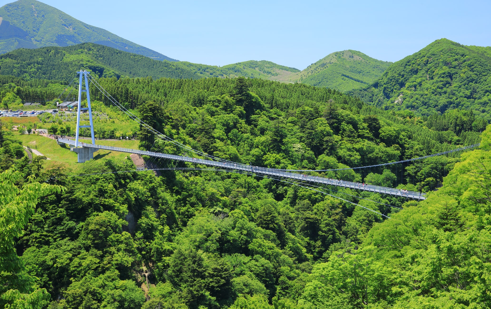
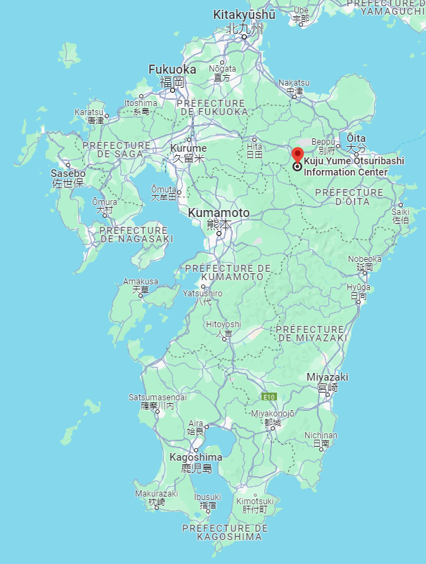
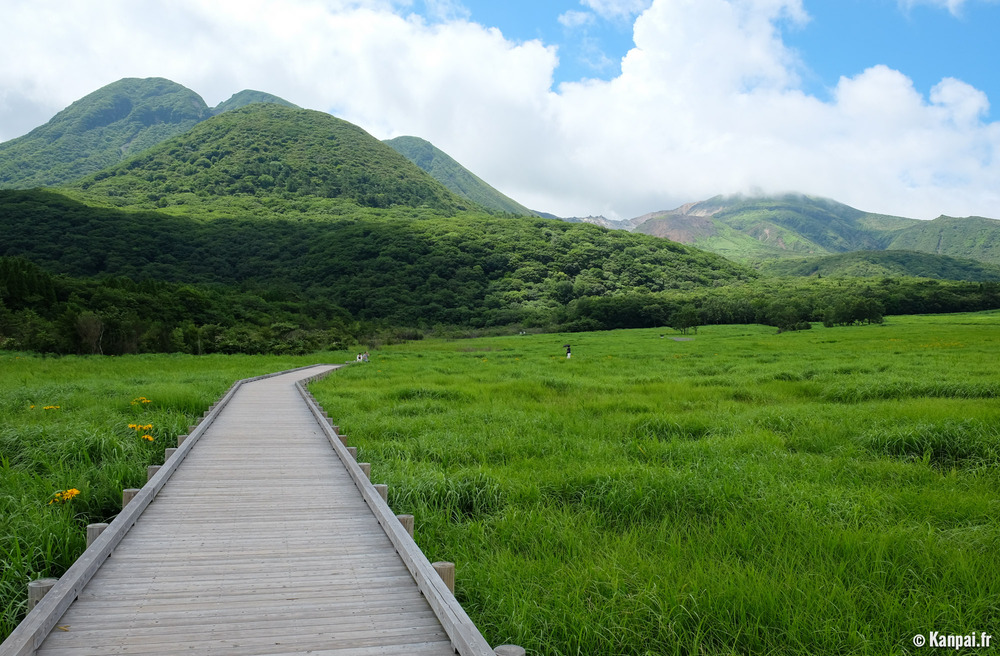
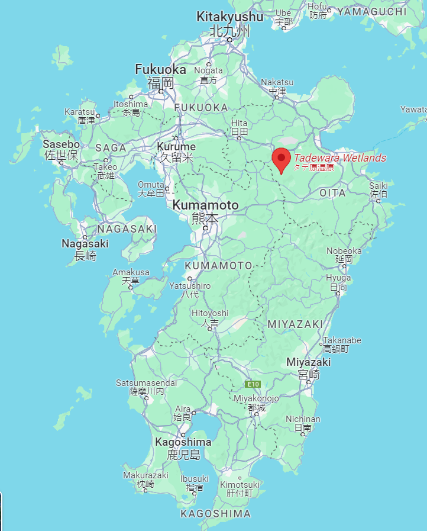
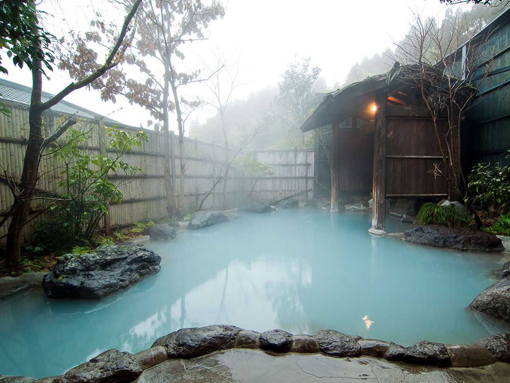
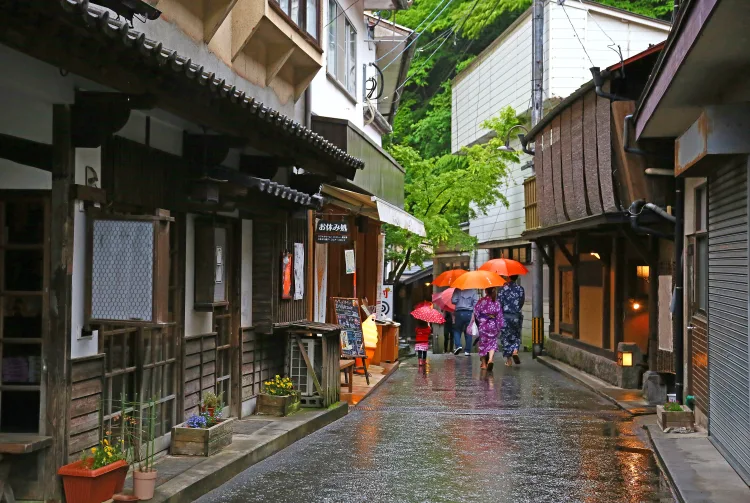

# Kyushu

## Prefectures

- Fukuoka
- Saga
- Nagasaki
- Kumamoto
- Ooita
- Miyazaki
- Kagoshima
- Okinawa

## Ooita

### Pont Kokonoe Yume

Pont suspendu à 173m, vue splendide notamment sur deux des plus belles cascades du Japon. Le pont piéton le plus long et le plus élevé de tout le Japon.  
Randonnées possibles aux monts monts Mimata et Waita.  
"La meilleure période pour s'y rendre [...] de mi-avril à mai lorsque la vallée se pare d'un feuillage vert luxuriant."  
À proximité de plusieurs sources chaudes dont Kanno Jigoku, Ukenokuchi et Chojabaru.

| Prix | Note | Site                                                                                             | Distance de Fukuoka | Durée conseillée      | Préfécture | Meilleure période |
| ---- | ---- | ------------------------------------------------------------------------------------------------ | ------------------- | --------------------- | ---------- | ----------------- |
| 500¥ | ⭐⚫⚫  | [Ici](https://yumeooturihashi.com/eng/) ou [Japan travel](https://www.japan.travel/fr/spot/695/) | 2h20                | $\frac{1}{2}$ journée | Ooita      | Mi-avril - mai    |

| Photo                               | Plan                                     |
| ----------------------------------- | ---------------------------------------- |
|  |  |

### Marais de Taderawa

Des marais préservés, une faune et flore rares et de superbes randonnées dans les environs. Magnifique passerelle en cèdre qui traverse le marais.  
Randonnées possibles aux monts Hosho et Mimata.  
**Conseil** : faire un tour au [centre d'informations de Chojabaru](https://www.japan.travel/national-parks/parks/aso-kuju/see-and-do/chojabaru-visitor-center/), exposition sur la flore et la faune du parc national Aso-Kuju (💴gratuit, 🕝45min).

| Prix      | Note | Site                                                  | Distance de Fukuoka | Durée conseillée | Préfécture | Meilleure période |
| --------- | ---- | ----------------------------------------------------- | ------------------- | ---------------- | ---------- | ----------------- |
| *Gratuit* | ⭐⭐⚫  | [Japan travel](https://www.japan.travel/fr/spot/432/) | 1h50                | N/A              | Ooita      | N/A               |

| Photo                           | Plan                                 |
| ------------------------------- | ------------------------------------ |
|  |  |

### Kurokawa Onsen

Kurokawa Onsen est une ville bordée d'une rivière, comportant un ensemble de 29 onsen ! Dont des bains publics et des ryokans (auberges traditionnelles privatives, assez luxueuses). Belles forêt et rivière avoisinantes. "Surtout de janvier à mars, quand les lanternes de bambou illuminent Kurokawa".  
> Japan travel :   
> "Certain times of year are famously beautiful in Japan, such as cherry blossom season in spring. Particularly good times to visit are autumn, for the temperate climate, and winter, for the chilly weather."

Athmosphère traditionnelle, loin de l'aspect urbain des grandes villes japonaises.  
Belles randonnées possible aux alentours. Cartes disponibles au centre d'informations.  
Il y a des bains souterrains et même des bains depuis lesquels on peut voir des cascades !  
Grande diversité de restaurants et d'enseignes à souvenirs.
**Conseil** : acheter le *Nyuto Tegata onsen-hopping pass* (💴1,300¥, donne accès à 3 bains termaux).
**Conseil** : acheter le *bar-hopping pass* pour goûter des sakés et des sochus.
**Conseil** : se balader dans la ville en *yukata* (des kimonos).

| Prix      | Note | Site                                                  | Distance de Fukuoka | Durée conseillée | Préfécture | Meilleure période |
| --------- | ---- | ----------------------------------------------------- | ------------------- | ---------------- | ---------- | ----------------- |
| *Gratuit* | ⭐⭐⚫  | [Japan travel](https://www.japan.travel/en/spot/643/) | 2h00                | 1j               | Kumamoto   | Janvier-mars      |

| Photo                            | Photo                            | Photo                             | Plan                                |
| -------------------------------- | -------------------------------- | --------------------------------- | ----------------------------------- |
|  |  |  |  |