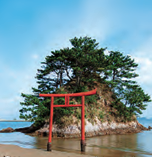
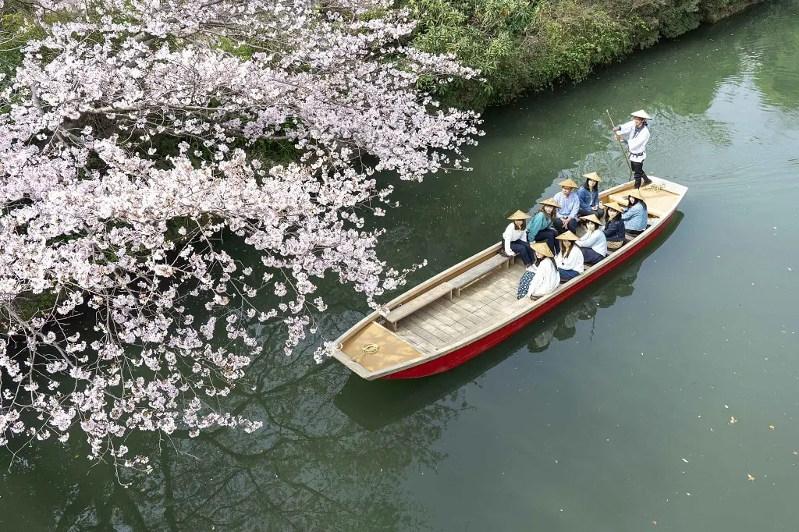
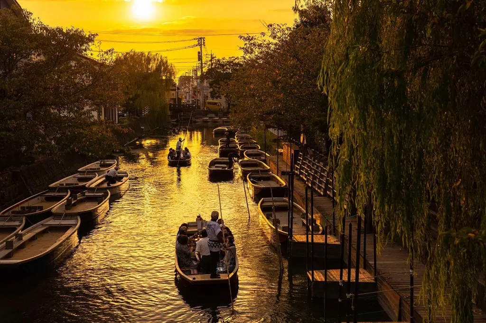
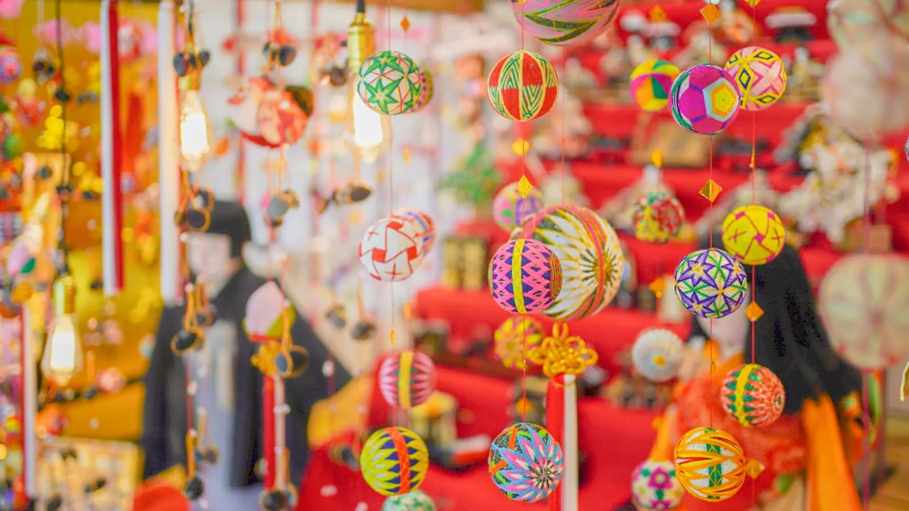
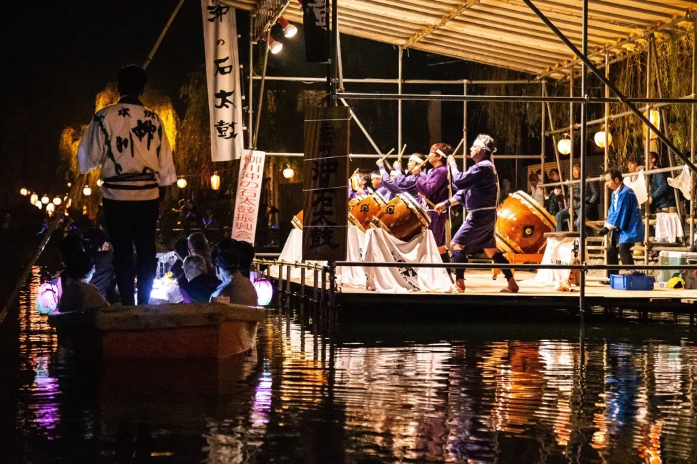
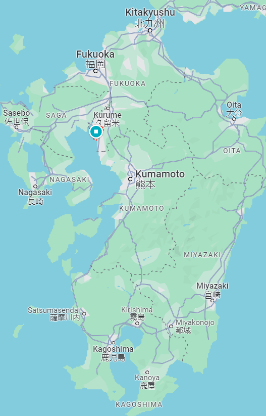
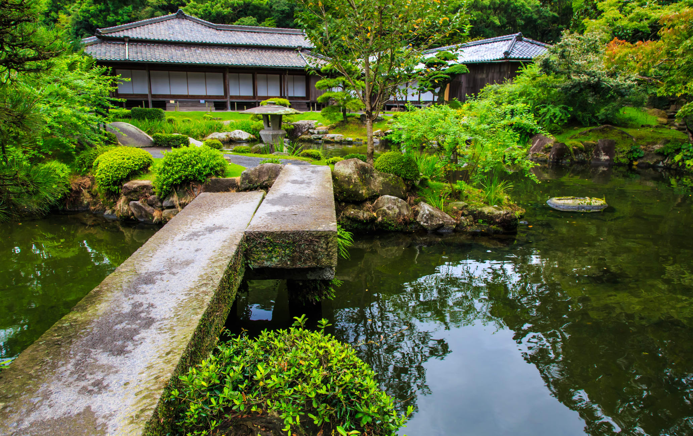
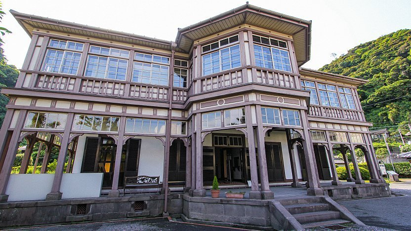

# Sommaire

<!--START-->
- [Points importants](#points-importants)
- [Ressources utiles](#ressources-utiles)
  - [Modes de déplacement](#modes-de-déplacement)
- [Préféctures](#préféctures)
- [Fukuoka](#fukuoka)
  - [Parcours Munakata Oshima du Kyushu OLLE](#parcours-munakata-oshima-du-kyushu-olle)
  - [Yanagawa](#yanagawa)
- [Oita](#oita)
  - [Pont Kokonoe Yume](#pont-kokonoe-yume)
  - [Marais de Taderawa](#marais-de-taderawa)
  - [Kurokawa Onsen](#kurokawa-onsen)
  - [Parcours Okubungo du Kyushu OLLE](#parcours-okubungo-du-kyushu-olle)
  - [Onsen Hyotan](#onsen-hyotan)
- [Nagasaki](#nagasaki)
  - [Nagasaki (la ville)](#nagasaki-la-ville)
    - [1. Dejima](#1-dejima)
    - [2. Musée de la Bombe atomique de Nagasaki](#2-musée-de-la-bombe-atomique-de-nagasaki)
    - [3. Mémorial national de la paix de Nagasaki aux victimes de la bombe atomique](#3-mémorial-national-de-la-paix-de-nagasaki-aux-victimes-de-la-bombe-atomique)
- [Kagoshima](#kagoshima)
  - [Izumi](#izumi)
  - [Île Yakushima](#île-yakushima)
    - [1. Cèdre Jomon-sugi et son parcours](#1-cèdre-jomon-sugi-et-son-parcours)
    - [2. Itinéraire Shiratani-unsuikyo](#2-itinéraire-shiratani-unsuikyo)
    - [3. Forêt Yakusugi Land](#3-forêt-yakusugi-land)
    - [4. Itinéraire Miyanoura-dake](#4-itinéraire-miyanoura-dake)
  - [Kagoshima (la ville)](#kagoshima-la-ville)
    - [1. Jardin Sengan-en](#1-jardin-sengan-en)
- [Kumamoto](#kumamoto)
  - [Kumamoto (la ville)](#kumamoto-la-ville)
    - [1. Le château Kumamoto-jo](#1-le-château-kumamoto-jo)
    - [2. Le jardin Suizenji](#2-le-jardin-suizenji)
<!--END-->

# Points importants

- Les aéroports de Kumamoto, Nagasaki, Kagoshima et Oita sont éloignés des centres, il vaut mieux visiter une voiture pour les visiter.

- Prévoir des espèces : "dans certaines régions rurales, trouver un DAB relève de l'anventure". Retirer dans les DAB des JP Bank ou des les 7-Eleven.

# Ressources utiles

- [Site officiel du tourisme à Kyushu](https://www.visit-kyushu.com/en/)
- Le site [Kyushu OLLE](https://kyushuolle.welcomekyushu.jp/en/) regroupe un grand nombre de belles randonnées sur l'île. Chacune est **très bien** détaillée (parcours, étapes, photos, contact, gastronomie locale et j'en passe).

## Modes de déplacement

| Train                                                                                                                                        | Bus                                                                                                     | voiture                                                                                                     |
| -------------------------------------------------------------------------------------------------------------------------------------------- | ------------------------------------------------------------------------------------------------------- | ----------------------------------------------------------------------------------------------------------- |
| Le shinkansen relie Fukuoka, Kugamoto et Kagoshima. Les autres grandes villes sont désservies par des trains régionaux souvent peu pratiques | Pratiques pour relier les grandes villes. Acheter les billets dans les gares routières ou les aéroports | Moyen le plus pratique de se déplacer. Se méfier des raccourcis par des routes de montagne, parfois étroits |

  

# Préféctures

  

# Fukuoka

## Parcours Munakata Oshima du Kyushu OLLE

Très belle randonnée de 11km sur l'île d'Oshima. Sur cette île se trouvent deux sanctuaires nommés patrimoine mondial de l'UNSECO. L'île est majoritairement dominée par la nature avec ses montagnes et forêts.

L'île comporte des auberges et des minshuku (version low-budget d'un Ryokan).

| Prix 💴    | Note | Site                                                                                              | Distance de Fukuoka | Durée conseillée | Meilleure période |
| --------- | ---- | ------------------------------------------------------------------------------------------------- | ------------------- | ---------------- | ----------------- |
| *Gratuit* | ⭐⭐⚫  | [Ici](https://kyushuolle.welcomekyushu.jp/en/courses/detail/0e14e405-ed4d-4e70-85ce-73448cfa0f2e) | 1h 🚗 + 25min ⛵      | Balade de 4-5h   | N/A               |

| Moulin à vent                            | Micro-île Yume no Sayoshima              | Le Minshuku Manabe                     | Plan                                    |
| ---------------------------------------- | ---------------------------------------- | -------------------------------------- | --------------------------------------- |
|  |  |  |  |

## Yanagawa

Surnommée la "Venise de Kyushu", la ville de Yanagawa est connue pour ses 470km de canaux, que l'on peut parcourir dans une petite barque avec un guide (un batelier). Yanagawa propose beaucoup de spécialités culinaires à base de produits de la mer (provenant de la baie Ariake), la plus connue étant une recette vielle de plusieurs siècles, des anguilles à la vapeur accompagnées de riz, dont la sauce est gardée secrète et transmise de génération en génération.  
La ville célèbre divers festivals au cours de l'année, dont le [festival des poupées de Yanagawa](https://www.japan.travel/fr/fr/informations-de-nos-partenaires/festival-des-poupees-de-yanagawa/), durant lequel on suspend de splendides boules décoratives faites à la main (un style particulièrement joli sont les Yanagawa Mari).

**Conseil** : acheter le *Yuttari Yanagawa Ticket Pack* à la station *Nintetsu Tenjin* (💴3,170¥), qui donne les bénéfices suivants :
- le billet aller-retour (l'aller seul c'est 850¥)
- un tour en bateau de 70min
- une entrée au onsen *Kampo-no-yado Yanagawa*
- une carte de la ville en anglais explicative

**Conseil** : à 3min du point d'arrivée de la balade en bateau se trouve le *Ohana Shohtoen*, constitué d'un jardin, d'un musée et d'une ancienne résidence au style européen (💴500¥).

Pour un peu plus d'informations (onsens, résidences, temples, musées, photos), voir notamment l'article Japan Guide.

| Note | Site                                                                                                                                                                      | Distance de Fukuoka | Durée conseillée | Meilleure période                                                                                                                     |
| ---- | ------------------------------------------------------------------------------------------------------------------------------------------------------------------------- | ------------------- | ---------------- | ------------------------------------------------------------------------------------------------------------------------------------- |
| ⭐⭐⚫  | [Ici](https://www.yanagawa-net.com/en/) ou [article Japan travel](https://www.japan.travel/en/au/story/insiders-guide-yanagawa/) ou [article Japan Guide](https://www.japan-guide.com/community/mfedley/report-2676) | 45min 🚆 ou 30min 🚗  | N/A              | `"Each season has its own appeal"`, `Mi février - début avril pour le Festival des Poupées`, `au printemps pour les sakuras en fleur` |

| Canal                      | Canal                      | Yanagawa Mari                  | Un événement ayant lieu lors d'un festival (celui-ci a lieu en novembre) | Plan                          |
| -------------------------- | -------------------------- | ------------------------------ | ------------------------------------------------------------------------ | ----------------------------- |
|  |  |  |                                                |  |

  

# Oita

## Pont Kokonoe Yume

Pont suspendu à 173m, vue splendide notamment sur deux des plus belles cascades du Japon. Le pont piéton le plus long et le plus élevé de tout le Japon.  
Randonnées possibles aux monts monts Mimata et Waita.  
"La meilleure période pour s'y rendre [...] de mi-avril à mai lorsque la vallée se pare d'un feuillage vert luxuriant."  
À proximité de plusieurs sources chaudes dont Kanno Jigoku, Ukenokuchi et Chojabaru.

| Prix 💴 | Note | Site                                                                                             | Distance de Fukuoka | Durée conseillée      | Meilleure période |
| ------ | ---- | ------------------------------------------------------------------------------------------------ | ------------------- | --------------------- | ----------------- |
| 500¥   | ⭐⚫⚫  | [Ici](https://yumeooturihashi.com/eng/) ou [Japan travel](https://www.japan.travel/fr/spot/695/) | 2h20 🚗              | $\frac{1}{2}$ journée | Mi-avril - mai    |

| Photo                               | Plan                                     |
| ----------------------------------- | ---------------------------------------- |
|  |  |

## Marais de Taderawa

Des marais préservés, une faune et flore rares et de superbes randonnées dans les environs. Magnifique passerelle en cèdre qui traverse le marais.  
Randonnées possibles aux monts Hosho et Mimata.  
**Conseil** : faire un tour au [centre d'informations de Chojabaru](https://www.japan.travel/national-parks/parks/aso-kuju/see-and-do/chojabaru-visitor-center/), exposition sur la flore et la faune du parc national Aso-Kuju (💴gratuit, 🕝45min).

| Prix 💴    | Note | Site                                                  | Distance de Fukuoka | Durée conseillée | Meilleure période |
| --------- | ---- | ----------------------------------------------------- | ------------------- | ---------------- | ----------------- |
| *Gratuit* | ⭐⭐⚫  | [Japan travel](https://www.japan.travel/fr/spot/432/) | 1h50 🚗              | N/A              | N/A               |

| Photo                           | Plan                                 |
| ------------------------------- | ------------------------------------ |
|  |  |

## Kurokawa Onsen

Kurokawa Onsen est une ville bordée d'une rivière, comportant un ensemble de 29 onsen ! Dont des bains publics et des ryokans (auberges traditionnelles privatives, assez luxueuses). Belles forêt et rivière avoisinantes. "Surtout de janvier à mars, quand les lanternes de bambou illuminent Kurokawa".  
> Japan travel :   
> "Certain times of year are famously beautiful in Japan, such as cherry blossom season in spring. Particularly good times to visit are autumn, for the temperate climate, and winter, for the chilly weather."

Athmosphère traditionnelle, loin de l'aspect urbain des grandes villes japonaises.  
Belles randonnées possible aux alentours. Cartes disponibles au centre d'informations.  
Il y a des bains souterrains et même des bains depuis lesquels on peut voir des cascades !  
Grande diversité de restaurants et d'enseignes à souvenirs.
**Conseil** : acheter le *Nyuto Tegata onsen-hopping pass* (💴1,300¥, donne accès à 3 bains termaux).
**Conseil** : acheter le *bar-hopping pass* pour goûter des sakés et des sochus.
**Conseil** : se balader dans la ville en *yukata* (des kimonos).

| Prix 💴    | Note | Site                                                  | Distance de Fukuoka | Durée conseillée | Meilleure période |
| --------- | ---- | ----------------------------------------------------- | ------------------- | ---------------- | ----------------- |
| *Gratuit* | ⭐⭐⚫  | [Japan travel](https://www.japan.travel/en/spot/643/) | 2h00 🚗              | 1 jour           | Janvier-mars      |

| Photo                            | Photo                            | Photo                             | Plan                                |
| -------------------------------- | -------------------------------- | --------------------------------- | ----------------------------------- |
|  |  |  |  |

## Parcours Okubungo du Kyushu OLLE

Très belle randonnée de 12km traversant le coeur de la préfécture d'Oita. C'est la seule directement recommandée par le livre et c'est la première qui apparaît sur le site. Le parcours inclut notamment les ruines du château Okajo, un temple avec d'immenses statues bouddhiques, la ville de samouraïs Taketa. La ville d'arrivée propose un onsen.

| Prix 💴    | Note | Site                                                                                              | Distance de Fukuoka | Durée conseillée | Meilleure période           |
| --------- | ---- | ------------------------------------------------------------------------------------------------- | ------------------- | ---------------- | --------------------------- |
| *Gratuit* | ⭐⭐⚫  | [Ici](https://kyushuolle.welcomekyushu.jp/en/courses/detail/8766c36c-d99f-4987-b20d-44ff87639915) | 2h30 🚗              | 1 jour           | Pas les jeudi (onsen fermé) |

| Statues bouddhistes                          | Taketa                                      | Plan                                      |
| -------------------------------------------- | ------------------------------------------- | ----------------------------------------- |
|  |  |  |

## Onsen Hyotan

Datant de plus d'un siècle, cet onsen regroupe 14 bains privatifs ainsi que de nombreux bains publics dont un bain de sable. C'est l'unique onsen triple-étoilé de michelin.  
Contraitement à beaucoup d'onsens au Japon, l'eau y could en continu donc est très pure. Il y a aussi des bains de vapeur et des spécialités culinaires, certaines chauffées à la vapeur des sources.

| Prix 💴                                                   | Note | Site                                     | Distance de Fukuoka | Durée conseillée      | Meilleure période |
| -------------------------------------------------------- | ---- | ---------------------------------------- | ------------------- | --------------------- | ----------------- |
| `940¥/p bains publics journée` ou `2,400¥ bain privé 1h` | ⭐⭐⚫  | [Ici](https://hyotan-onsen.com/english/) | 2h 🚗                | $\frac{1}{2}$ journée | N/A               |

| Bain air libre                         | Bain de sable                          | Plan                               | Plan                               |
| -------------------------------------- | -------------------------------------- | ---------------------------------- | ---------------------------------- |
|  |  |  |  |

  

# Nagasaki

## Nagasaki (la ville)

Avant les destructions de la Seconde Guerre mondiale, Nagasaki ainsi que d'autres lieux de la préfécture étaient les seuls liens du Japon avec le reste du monde.

| Note | Site | Distance de Fukuoka | Durée conseillée | Plan                          |
| ---- | ---- | ------------------- | ---------------- | ----------------------------- |
| ⭐⭐⭐  | N/A  | 2h00 🚗              | Plusieurs jours  |  |

**Point important** : prévoir des chaussures de marche car la ville est valonnée

### 1. Dejima

Île artificielle en forme d'éventail dans le port de Nagasaki.  
**Pour la petite culture** : En 1641 le shogunat Tokugawa bannit les étrangers de tout le Japon 😐, à une excéption près : *Dejima*. Jusque dans les années 1850, cette parcelle néerlandaise de 15 000m² était le seul lieu où les étrangers étaient tolérés au Japon.

| Prix 💴 | Note | Site                                                                                                 | Durée conseillée |
| ------ | ---- | ---------------------------------------------------------------------------------------------------- | ---------------- |
| 510¥   | ⭐⚫⚫  | [Ici](https://nagasakidejima.jp/english/) ou [Japan Guide](https://www.japan-guide.com/e/e4408.html) | N/A              |

| Dessin de la configuration originale | Photo                           | Reproduction                       |
| ------------------------------------ | ------------------------------- | ---------------------------------- |
|     |  |  |

### 2. Musée de la Bombe atomique de Nagasaki

"Incontournable lors d'un passage à Nagasaki".  
Évocation de la destruction (photos, meubles, poteries, etc). Récits des survivants et des histoires de sauvetage. Récit sur les campagnes de désarmement suites à l'explosion.  
*Le guide m'a turbo spoilé la fin du musée* :|

| Prix 💴                  | Note | Site                                | Durée conseillée | Meilleure période |
| ----------------------- | ---- | ----------------------------------- | ---------------- | ----------------- |
| 200¥ (+154¥ audioguide) | ⭐⭐⚫  | [Ici](https://nagasakipeace.jp/en/) | N/A              | N/A               | N/A |

| Photo                                         | Photo                                          |
| --------------------------------------------- | ---------------------------------------------- |
|  |  |

### 3. Mémorial national de la paix de Nagasaki aux victimes de la bombe atomique

Voisin du musée, un mémorial minimaliste profondément émouvant. Une salle souterraine remplie d'étagères de livres contenant le noms des défunts.

| Prix 💴    | Note | Site                                        | Durée conseillée | Meilleure période |
| --------- | ---- | ------------------------------------------- | ---------------- | ----------------- |
| *Gratuit* | ⭐⭐⚫  | [Ici](https://www.peace-nagasaki.go.jp/en/) | N/A              | N/A               |

| Photo                                     | Photo                                      |
| ----------------------------------------- | ------------------------------------------ |
|  |  |

  

# Kagoshima

## Izumi

Ville côtière paisible accueillant chaque année des milliers de grues sibériennes en migration. Il y a notamment le seul musée portant sur les grues du Japon, le Crane Park Izumi (💴220¥).

**Conseil** : faire un séjour à la ferme. Pratique touristique assez courante, *Izumi City Tourism* (voir site ci-dessous) coordonne des séjours dans 18 fermes différentes, et certains hôtes parlent bien anglais. La famille hôte nous montre notamment leurs activités de récolte, nous apprend à cuisiner des plats traditionnels, à jouer à des jeux locaux.

Il y a aussi le Hakozaki Hachiman Shrine, avec la plus grosse cloche du Japon (qu'on peut frapper gratuitement).

**Conseil** : visiter les *Samurai Residences* datant du 16 siècle (et le plus vieux temple Zen du Japon, Kannoji). Possible de porter un yukata pendant une visite. Il y a aussi un musée d'histoire, le Izumi-Fumoto, exposant des armures et armements des samouraïs.

**Conseil** : faire un tour de la ville en ox-cart (carrette tirée par des 🐮).

| Prix 💴                                      | Note | Site                                                                                           | Distance de Fukuoka | Durée conseillée | Meilleure période                                                                                                 |
| ------------------------------------------- | ---- | ---------------------------------------------------------------------------------------------- | ------------------- | ---------------- | ----------------------------------------------------------------------------------------------------------------- |
| `Gratuit (ville)`, le reste j'ai pas trouvé | ⭐⭐⚫  | [Ici](https://www.izumi-navi.jp/en/) ou [Japan travel](https://www.japan.travel/en/spot/1944/) | 1h10 🚆 ou 3h 🚗      | 1-2 jours        | Avant mars (pour voir les grues), sinon voir le PDF sur le site pour une liste des activités possibles par saison |

| Grues                       | Repas avec une famille hôte                    | Résidence de samouraï                     | Cloche du Hakozaki Hachiman Shrine                  | Plan                            |
| --------------------------- | ---------------------------------------------- | ----------------------------------------- | --------------------------------------------------- | ------------------------------- |
|  |  |  |  |  |

## Île Yakushima

Île tropicale couverte d'une forêt de cèdres, dont certains des plus vieux arbres japonais. Ceux dépassant le millénaires sont appelés *yakusugi*, provenant de *Yakushima* et *sugi*, le terme japonais pour "cèdre". Le plus ancien avoisinerait 7 000 ans.  
Certains sites sont nommés patrimoine mondial de l'UNSECO, beaucoup de touristes se rendent ici pour faire des randonnées.  
Apparemment il pleut beaucoup `a local saying claiming that it rains "35 days a month"`. Les montagnes constituent l'endroit le plus humide du Japon.  
Les principales randonnées proposent des plans de route (un tozan todokede) et brochures en anglais au point de départ. Le site [Yakumonkey](https://yakumonkey.com) propose un guide pour pratiquer la randonnée sur l'île.  
Il est possible de passer la nuit sur la montagne, et donc de faire des randonnées sur plusieurs jours.

| Note | Site                                                                                                                                     | Distance de Fukuoka | Durée conseillée | Plan                           |
| ---- | ---------------------------------------------------------------------------------------------------------------------------------------- | ------------------- | ---------------- | ------------------------------ |
| ⭐⭐⭐  | [Pour la randonnée](https://www.yakumonkey.com/yakushima-guide-book-update-2018) [Japan Guide](https://www.japan-guide.com/e/e4650.html) | 2h 🚆 + 2-3h ⛵       | N/A              |  |

### 1. Cèdre Jomon-sugi et son parcours

Parmi les "grands classiques" de Kyushu, un immense yakusugi datant de 2000 à 7000 ans. Il reste imposant même s'il n'est plus vivant. C'est l'attraction principale de l'île.  
En général les randonneurs rejoignent Jomon-sugi par la randonnée Arakawa-tozanguchi, un sentier de 19,5km (8-10h aller-retour). Le parcours inclut d'autres arbres bien connus comme le Meotosugi (une paire d'arbre qui se rassemblent à plusieurs mètres du sol), ou encore le Daiosugi, un des plus gros arbres de l'île.  
*Attention* : de mars à novembre, si on choisit le parcours Arakawa-tozanguchi, on doit prendre un bus depuis le musée Yakusugi (qui relate l'histoire de l'île, et notamment des forêts de cèdres) jusqu'au départ (💴 2,400¥ aller-retour, 🕝 40min).  

| Prix 💴               | Note | Site                                                    | Durée conseillée | Meilleure période                                                                 |
| -------------------- | ---- | ------------------------------------------------------- | ---------------- | --------------------------------------------------------------------------------- |
| Variable (transport) | ⭐⭐⚫  | [Japan Guide](https://www.japan-guide.com/e/e4653.html) | 8-10h            | Surtout pas entre mi-juillet et mi-septembre (vacances), ni durant la Golden Week |

| Le Jomon-sugi                       | Première partie du sentier                    | Seconde partie du sentier                      | Le Meotosugi (je crois)                      |
| ----------------------------------- | --------------------------------------------- | ---------------------------------------------- | -------------------------------------------- |
|  |  |  |  |

### 2. Itinéraire Shiratani-unsuikyo

Parcours plus varié que le Arakawa-tozanguchi, il passe par des cascades, rochers couverts de mousse et un yakusugi imposant qui domine le parcours de Taikoiwa. Ses paysages ont inspiré l'univers de Mononoke Hime (Princesse Mononoke).  
Plusieurs variantes du parcours sont possibles, et on peut rejoindre l'itinéraire Arakawa-tozanguchi si on le souhaite.

> Note : on peut avoir un tarif réduit si on prend aussi le ticket pour Yakusugi Land

| Prix 💴   | Note | Site                                                    | Durée conseillée                             | Meilleure période |
| -------- | ---- | ------------------------------------------------------- | -------------------------------------------- | ----------------- |
| 300-500¥ | ⭐⭐⭐  | [Japan Guide](https://www.japan-guide.com/e/e4654.html) | 3-4h (petite version) - 12h (grande version) | N/A               |

| Photo                               | Photo                               | Photo                               |
| ----------------------------------- | ----------------------------------- | ----------------------------------- |
|  |  |  |

### 3. Forêt Yakusugi Land

Parc naturel remplis de yakusugi. Les chemins sont bien aménagés, notamment avec diverses passerelles qui traversent les cours d'eau. Si on est pressés on peut tout de même voir de beaux cèdres sans trop s'enfoncer dans la forêt. Le parc comprend une grande variété de parcours (généralement entre 30min et 2h30). Il y a des panneaux en anglais sur le chemin.

> Note : on peut avoir un tarif réduit si on prend aussi le ticket pour Shiratani-unsuikyo

| Prix 💴   | Note | Site                                                                                                       | Durée conseillée | Meilleure période |
| -------- | ---- | ---------------------------------------------------------------------------------------------------------- | ---------------- | ----------------- |
| 300-500¥ | ⭐⭐⚫  | [Ici en full-japonais](https://y-rekumori.com/) ou [Japan Guide](https://www.japan-guide.com/e/e4655.html) | 30min - 2h30     | N/A               |

| Sentier                        | Passerelle                     | Le Kigensugi                            |
| ------------------------------ | ------------------------------ | --------------------------------------- |
|  |  |  |

### 4. Itinéraire Miyanoura-dake

Plus ancien parcours de Yakushima, il mène au Miyanoura-dake (1,936m), point culminant de l'île et de tout Kyushu ! La randonnée prend environ 7h et propose une flore et une faune uniques.

| Prix 💴 | Note | Site                                                                                 | Durée conseillée | Meilleure période |
| ------ | ---- | ------------------------------------------------------------------------------------ | ---------------- | ----------------- |
| ?      | ⭐⭐⚫  | [Japan travel](https://en.japantravel.com/kagoshima/mt-miyanoura-in-yakushima/32956) | 7h à 12h         | N/A               |

| Photo                           | Photo                           | Photo                           |
| ------------------------------- | ------------------------------- | ------------------------------- |
|  |  |  |

## Kagoshima (la ville)

### 1. Jardin Sengan-en

Datant du milieu du XVIIe siècle, c'est un domaine valonné de 5 hectares fait de jardins, mares, ruisseaux, bambous et de sentiers au bord de la baie Kinko-wan.  
Les principales particularités du jardin sont l'utilisation de la baie de Kagoshima ainsi que dun Sakurajima comme paysages empruntés.  
Au centre du jardin se trouve la résidence Iso, qui a servi de foyer au clan Shimazu, qui a construit le jardin.  
Plusieurs éléments du Senganen sont classés patrimoine mondial, notamment des vestiges du *Shuseikan Industrial Complex* qui produisait du fer pour les navires.

"Si vous vous trouvez dans la région de Kagoshima, cette destination est à placer en tête de votre liste de visites."

> Attention : le bâtiment principal du musée est fermé jusqu'à octobre 2024 pour cause de rénovations 😢  
> Certains restes du complexe industriel sont éloignés du parc et difficiles d'accès

| Prix 💴                                                                                             | Note | Site                                                                                                             | Durée conseillée | Meilleure période                                                                                                           |
| -------------------------------------------------------------------------------------------------- | ---- | ---------------------------------------------------------------------------------------------------------------- | ---------------- | --------------------------------------------------------------------------------------------------------------------------- |
| `200¥ (résidence Ijinkan)`, `1,000¥ (jardin & musée)` ou `1,200¥ (jardin & musée + résidence Iso)` | ⭐⭐⚫  | [Japan Guide](https://www.japan-guide.com/e/e4602.html) ou [Japan travel](https://www.japan.travel/fr/spot/602/) | 1 jour           | Sa flore variée fait du jardin une destination intéressante peu importe la saison (janvier-avril pour les sakuras en fleur) |

| Jardin                               | Jardin                               | Résidence Ijinkan                           |
| ------------------------------------ | ------------------------------------ | ------------------------------------------- |
|  |  |  |

  

# Kumamoto

## Kumamoto (la ville)

### 1. Le château Kumamoto-jo

Bâti entre 1601 et 1607, c'est l'un des châteaux les plus spectaculaires du Japon. Il propose une grande variété de bâtiments, notamment la tour Uto ou le palais Honmaru Goten, qui a été reconstruit pour le 400e anniversaire du château et ouvert en 2008.  
À traver les époques, le château a subi plusieurs destructions, dont la guerre civile de Seinan durant laquelle il a joué un rôle crucial en résistant à un siège de deux mois.  
Le château a vu nombre de ses bâtiments détruits et a connu plusieurs restaurations, mais récemment (en 2016), un séisme l'a frappé, causant l'effondrement de plusieurs bâtiments et nécessitant la fermeture du château. Le donjon a réouvert en 2021 mais une bonne partie du château reste hors d'accès, comme le palais Honmaru Goten.  
La tour Uto est un des rares bâtiments originaux encore intacts aujourd'hui.  
Les quelques 800 cerisiers de ses jardins en font une destination lorsqu'ils sont en fleurs.  

> Note : un festival de printemps ainsi qu'un festival d'automne ont lieu encore aujourd'hui au château, mais impossible de trouver les dates précises. Aussi il on peut acheter un forfait pour avoir accès à un musée.

| Prix 💴 | Note | Site                                                                                                   | Durée conseillée | Meilleure période                         |
| ------ | ---- | ------------------------------------------------------------------------------------------------------ | ---------------- | ----------------------------------------- |
| 800¥   | ⭐⚫⚫  | [Ici](https://castle.kumamoto-guide.jp/en/) ou [Japan Gudie](https://www.japan-guide.com/e/e4501.html) | N/A              | Fin mars - début avril (sakuras en fleur) |

| Photo                        | Une salle du palais Honmaru Goten (fermée à cause du séisme) | La tour Uto                  |
| ---------------------------- | ------------------------------------------------------------ | ---------------------------- |
|  |              |  |

### 2. Le jardin Suizenji

Splentide jardin datant du XVIIe siècle. Il représente une reproduction des stations de la route Tokaido, qui reliait Edo et Kyoto. L'eau qui y coule est d'une grande qualité et utilisée pour faire des thés, si bien qu'une maison de thé a été contruite en son sein.  
Le bassin abrite des carpes koi et de jolis oiseaux. On peut le traverser sur un pont fort sympathique.

| Prix 💴   | Note | Site                                                                                                                                                                   | Durée conseillée | Meilleure période |
| -------- | ---- | ---------------------------------------------------------------------------------------------------------------------------------------------------------------------- | ---------------- | ----------------- |
| 350-400¥ | ⭐⚫⚫  | [Ici en full-japonais](http://www.suizenji.or.jp/) ou [Japan travel](https://www.japan.travel/en/spot/636/) ou [Japan Guide](https://www.japan-guide.com/e/e4502.html) | N/A              | N/A               |

| Photo                           | Le Izume Shrine                               | Habitant du parc                      |
| ------------------------------- | --------------------------------------------- | ------------------------------------- |
|  |  |  |